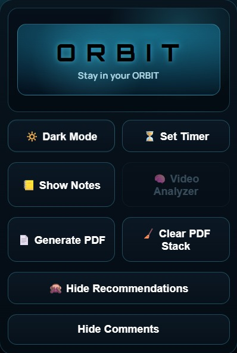
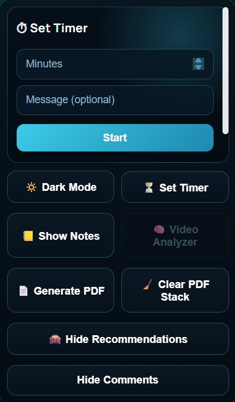
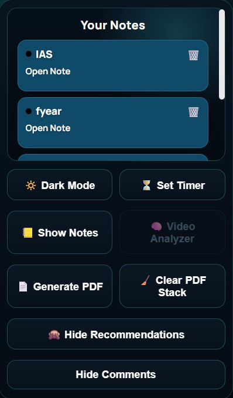
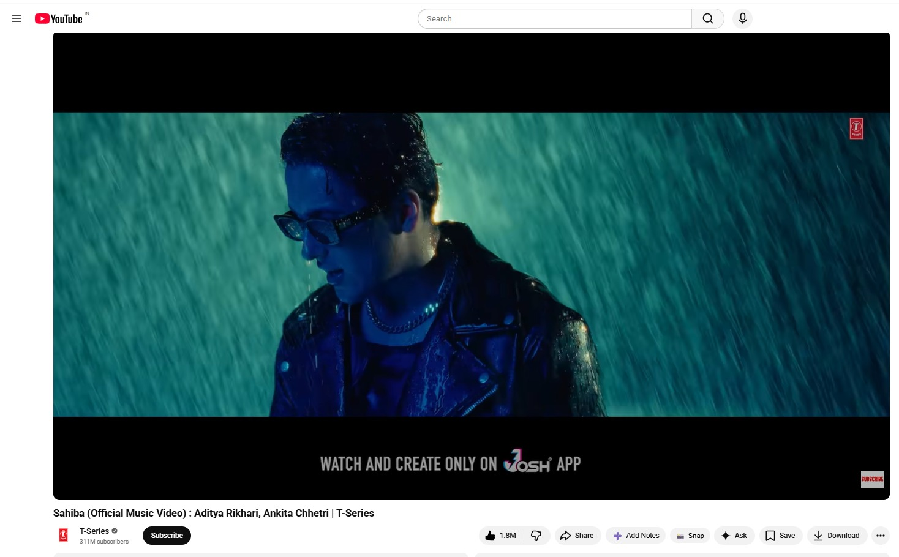
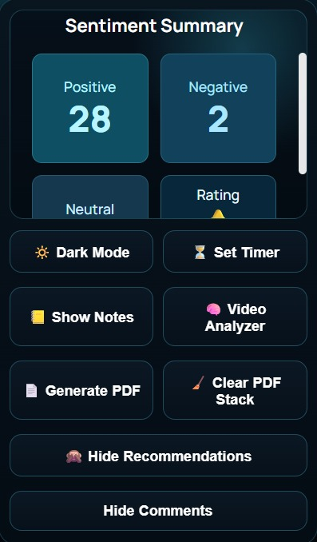

# 🚀 Orbit

<h3 align="center">
Watch Smarter • Stay Focused • No Distractions
</h3>

<p align="center">
An open-source Chrome Extension that transforms YouTube into a distraction-free and productivity-focused learning environment.
</p>

<p align="center">
  
  
  
  
  
</p>

---

## 🌍 The Problem

YouTube is great for learning, but it is not designed for focus.

- 📺 Recommended videos keep pulling attention away  
- 💬 Comments create distraction and clutter  
- ⏳ Users spend more time than intended  
- 🎯 It becomes hard to stay focused on one goal  

Because of this, users lose productivity and control over their time.

---

## 💡 The Solution - Orbit

Orbit turns YouTube into a **focused and productive learning space**.

- ✨ Removes distracting elements like recommendations and comments  
- ✨ Helps users stay in control with a focus timer and notes  
- ✨ Provides a clean and distraction-free interface  

### 🔍 Video Analyzer

Orbit includes a **Video Analyzer** that helps users quickly understand the quality of a video.

- Extracts comments from the video  
- Classifies them into:
  - Positive  
  - Negative  
  - Neutral  
- Gives an overall idea of audience opinion  
- Generates a simple rating based on sentiment and engagement  

This allows users to decide whether a video is worth their time - instantly.

---

## ✨ Features

### 🎯 Focus & Distraction Control

- 🚫 **Hide Recommendations**  
- 💬 **Hide Comments**

---

### ⚡ Productivity Tools

- 📝 **Notes System**  
- ⏱ **Focus Timer**  
- 🌗 **Dark Mode**  
- 📸 **Snapshot to PDF**  
- 🧹 **Clear Storage**

---

### 🧠 Smart Analysis

- 🔍 **Video Analyzer**  
- 📊 **Sentiment Classification**  
- ⭐ **Video Rating**

---

## 🔒 Privacy First

- ✅ No unnecessary data collection  
- ✅ Local-first design  
- ✅ User data stays under user control  

---

## 🧠 Architecture Overview

### 🖥 Client Layer - Chrome Extension
- HTML, CSS, JavaScript  
- YouTube DOM interaction  

---

### ⚙ Processing Layer
- FastAPI backend  
- Handles comment processing  

---

### 🧠 Model Layer
- DistilBERT (trained on 150k+ comments)  
- PyTorch, Transformers  

---

### ☁️ Cloud Layer
- AWS EC2 deployment  

---

## 🔄 Workflow

1. Open YouTube  
2. Orbit removes distractions  
3. Use tools like notes and timer  
4. Video Analyzer processes comments  
5. Results are displayed instantly  

---

## 📸 Screenshots

<table align="center">
<tr>
<td><b>1) Home Dashboard</b><br/></td>
<td><b>2) Focus Timer</b><br/></td>
</tr>
<tr>
<td><b>3) Notes Manager</b><br/></td>
<td><b>4) Add Notes and Snap button just below the video </b><br/></td>
</tr>
<tr>
<td colspan="2" align="center"><b>5) Sentiment Summary</b><br/></td>
</tr>
</table>

---

## ⚙️ Installation

1. Clone this repository to your local machine.

  ```bash
  git clone https://github.com/Rajat-Soni1058/ORBIT.git
  cd orbit
  ```

2. Open Google Chrome and go to `chrome://extensions/`.
3. Turn on **Developer mode** (top-right corner).
4. Click **Load unpacked**.
5. Select the folder that contains `manifest.json`:

  - `JSWORK/`

6. Once loaded, go to YouTube and open the Orbit extension from the Chrome extensions toolbar.
7. Start using Orbit features like Dark Mode, Focus Timer, Notes, PDF generation, and Video Analyzer.

### 🚀 Future Availability

In future releases, Orbit will also be available through the **Chrome Web Store**.
The publishing process takes time because Chrome Web Store listing requires detailed review and multiple permissions.